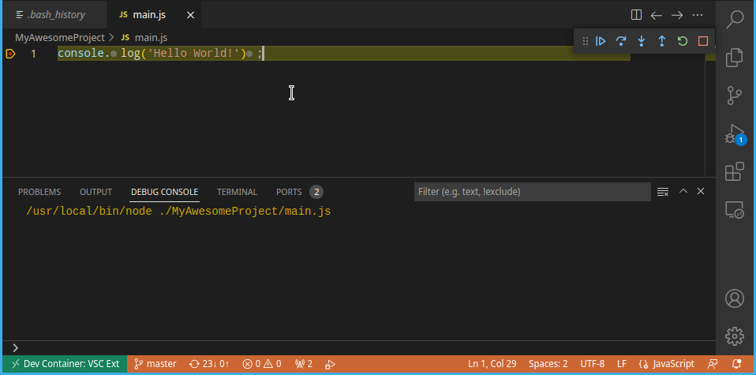

# debugadapter-evaluate README

VSCode extension to commands and evaluate expressions in Debug Console from tasks.json

## Features

VSCode allows shell commands to be automated. These run inside a new shell process. Sometimes, we need to attach to an existing process for debugging, which requires manual input in the debug console to set the application to a particular state.

This addon provides a basic interface to talk to the debug process programatically. Then tasks can be created to invoke commands in the debug console through the UI.

## Usage

> You must have an active debug session for this extension to work.

### Through UI

- search for and run `Debug Adapter: Evaluate`. You will be prompted to input an expression.



### Through `tasks.json`

```json
// .vscode/tasks.json
{
  "version": "2.0.0",
  "tasks": [
    {
      "label": "My custom expression",
      "command": "${input:input001}",
      "problemMatcher": [],
    },
  ],
  "inputs": [
    {
      "id": "input001",
      "type": "command",
      "command": "debugadapter-evaluate.evaluate",
      "args": "console.log('Hello World!')",
    },
  ],
}
```

### Through `keybindings.json`

Search for `Preferences: Open Keyboard Shortcuts (JSON)` in command palette

```json
// /home/aryan/.config/Code/User/keybindings.json
[
  {
    "key": "ctrl+k t",
    "command": "debugadapter-evaluate.evaluate",
    "args": "console.log('Hello World!')",
  }
]
```

You can also assign a keybinding to the task. This will let you share the keybinding with other projects containing the same task name.

```json
{
  "key": "ctrl+h",
  "command": "workbench.action.tasks.runTask",
  "args": "My custom expression"
}
```

## Alternatives

- VS Code already has a built in command `editor.debug.action.selectionToRepl`. However this only works with selected text and cannot be called programatically.

## Known Issues

- None

## Release Notes

### 1.0.0

Initial release
